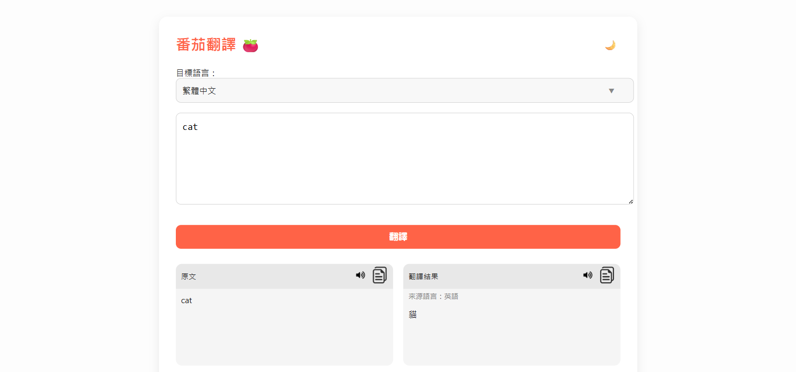

# 🍅 Tomato Translate - 番茄翻譯

Tomato Translate 是一個簡單易用的線上翻譯工具，使用 **OpenAI GPT 模型**，支援多國語言翻譯，具備語音朗讀、複製功能和深色模式。  
👉 **Demo 網站**：[https://pse.is/tomato-ts](https://pse.is/tomato-ts)

---

## ✨ 功能特色

- 🌍 支援多種語言互譯 (繁體中文、簡體中文、英文、日文、韓文、西班牙文、法文、德文等)
- 🎤 **語音朗讀**：支援原文與翻譯結果朗讀，會自動判斷語言選擇正確發音
- 🌓 **深色模式**：一鍵切換
- 📋 **一鍵複製**：快速複製翻譯結果或原文

---

## 📸 預覽畫面

